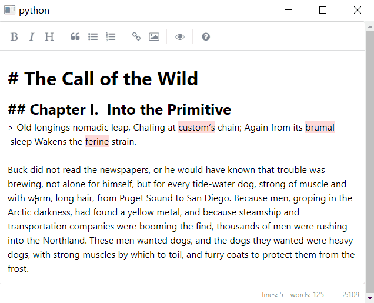

# In Memory of
2016-2017, my struggle with learning English words. I spent thousands of hours remembering GRE words, but still bad at using them. My grandfather passed away during that period in a traffic accident. He was a constant inspiration for me to learn more.

# Current Functionality
- Markdown editing with [simpleMDE](https://github.com/sparksuite/simplemde-markdown-editor).
- Ctrl+Enter to trigger synonyms display( using [Datamuse API](https://www.datamuse.com/api/)).
- Select and replace current word with the selected synonym.

# Future Functionality
- Word difinition display.
- Predefined sentence structure display.